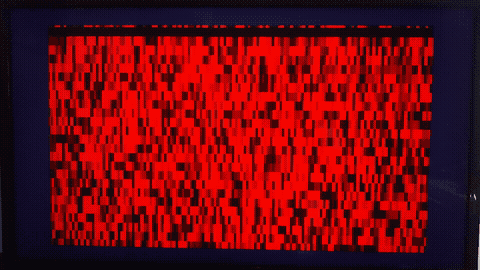

This is an (ongoing) implementation of an audio spectrometer targetting the GW1NR-9 on the Tang Nano 9K.

PROJECT DETAILS 
_________________

- Audio(8 bits) acquisition is over I2S. I'm working with the INMP441 but any compliant microphone should suffice. 

- The specific version of the Fourier transform used here is the STFT (256 samples); 

- Display is over the HDMI/DVI port on the Tang Nano 9K;

CURRENT STATE OF AFFAIRS
_________________________

With the simulated mic input, this comes out on the display:

Definitely not ideal, but progress nonetheless.

I suspect that there's a problem with the FFT draw order. It appears to be working in reverse (newer FFTs(spectral lines?) should be at the top and older ones at the bottom)

As soon as everything works as intended, the spectrogram itself will be centered; the extra blue area will be used to display axes data/scales.